# Diagrams
## Domain Model - Core Aggregates and Entities

## Invoice Lifecycle Workflow

## Validation Pipeline

## E-Invoice Transmission Flow

## Multi-Currency Invoice Calculation

```mermaid
flowchart LR
    subgraph "Line Item Calculation"
        Qty[Quantity] --> Mult1{×}
        Price[Unit Price] --> Mult1
        Mult1 --> LineNet[Line Net Amount]
        
        LineNet --> TaxCalc{Tax Calculation}
        TaxRate[Tax Rate] --> TaxCalc
        TaxCalc --> LineTax[Line Tax]
        
        LineNet --> LineTotal[Line Total]
        LineTax --> LineTotal
    end
    
    subgraph "Currency Conversion"
        LineTotal --> Conv{Exchange Rate}
        ExRate[Exchange Rate] --> Conv
        Conv --> BaseAmount[Base Currency Amount]
    end
    
    subgraph "Invoice Totals"
        LineNet --> Sum1[Sum Net Amounts]
        LineTax --> Sum2[Sum Tax by Category]
        Sum1 --> InvNet[Invoice Net Total]
        Sum2 --> InvTax[Invoice Tax Total]
        InvNet --> InvTotal[Invoice Total]
        InvTax --> InvTotal
        
        BaseAmount --> BaseSum[Sum Base Amounts]
        BaseSum --> BaseTotal[Base Currency Total]
    end
```

## Document Format Transformation

## Bounded Contexts

## Event Flow

